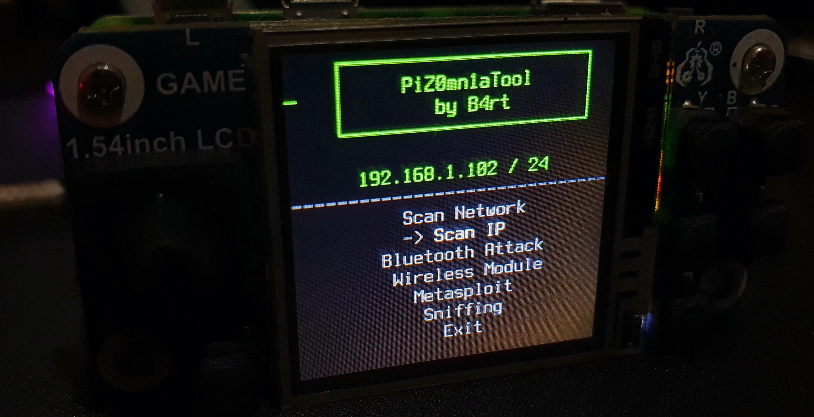
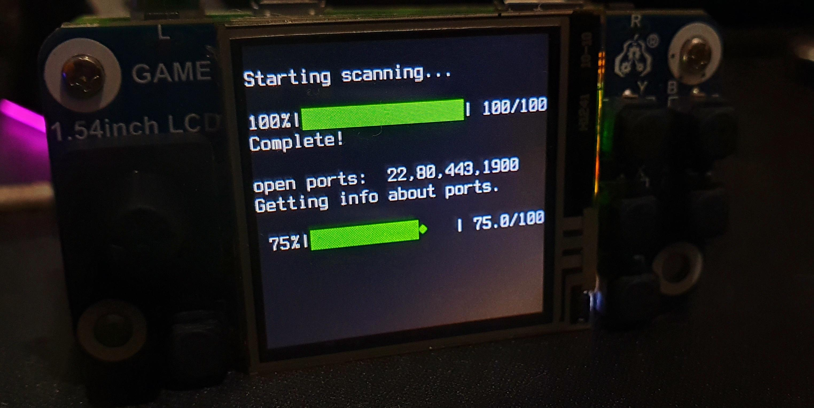
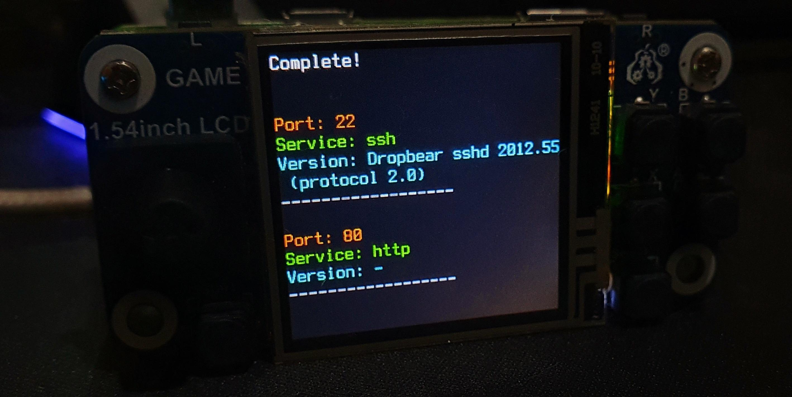

# PiZ0mn1aTool


[](https://github.com/theb4rt)
[](https://www.gnu.org/licenses/gpl-3.0)
[](https://twitter.com/the_b4rt)
[](https://elblogdebart.com)

PiZ0mn1aTool is a compact and powerful hacking tool, crafted around the Raspberry Pi Zero 2W, paired with a Display
Gaming LCD Hat.

## Requirements

- Raspberry Pi Zero 2W
- Display Gaming LCD Hat 1.44"
- Micro SD Card min. 16GB
- Power Supply (5V 2.5A)
- (Optional) USB WiFi Dongle: With monitor mode support, only needed for specific WiFi attacks such as deauth,
  etc. The internal WiFi card will work for most of the attacks.

## Installation

- Download the latest **_Raspberry Pi OS Lite_** image
  from [here](https://www.raspberrypi.org/software/operating-systems/#raspberry-pi-os-32-bit)
- Change resolution of displayed console by editing the file `/etc/default/console-setup` and setting:

```plaintext
# CONFIGURATION FILE FOR SETUPCON

ACTIVE_CONSOLES="/dev/tty[1-6]"
CHARMAP="UTF-8"
CODESET="guess"
FONTFACE="TerminusBold"
FONTSIZE="16x32"

VIDEOMODE=
```

- Install the LCD Hat 1.44" driver.
- Add these lines to your .bashrc file:

```bash
if [ "$(tty)" = "/dev/tty1" ]; then       
    sleep 2
    clear
    python3 {full_path_to/}PiZ0mn1aTool.py
fi
```

- Enable autologin to your user by editing these files:

    - `/etc/systemd/system/getty@.service`, in the [Service] section:

      ```bash
      ExecStart=-/sbin/agetty -J -i -N --nohostname -a {HERE YOUR USER} %I $TERM
      ```

    - `/etc/systemd/system/getty@tty1.service.d/autologin.conf`:

      ```bash
      [Service]
      ExecStart=
      ExecStart=-/sbin/agetty --autologin {HERE YOUR USER} --noclear %I $TERM
      ```

- Edit sudoers file to allow your user to run sudo without password:

```bash
{HERE YOUR USER}  raspberrypi= (root) NOPASSWD: /usr/bin/nmap
```

- Edit the file `/etc/wpa_supplicant/wpa_supplicant.conf` and add your WiFi network, remember to set the priority field.

```bash
ctrl_interface=DIR=/var/run/wpa_supplicant GROUP=netdev
update_config=1

network={
	ssid="YOUR_SSID"
	psk="YOUR_PASSWORD"
	priority=1
}

network={
    ssid="ANOTHER_SSID"
    psk="ANOTHER_PASSWORD"
    priority=2
}

```

## Images


<br>

<br>


## Authors

- [@theb4rt](https://github.com/theb4rt/)

## License

[GPLv3](https://choosealicense.com/licenses/gpl-3.0/)

